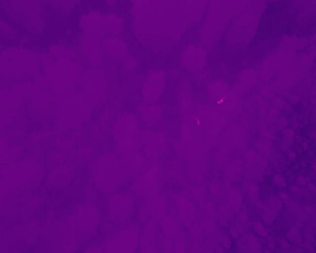
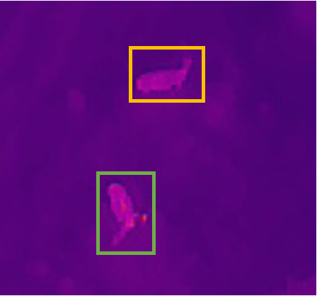

**Authors**: Hiroto Goto, Nicholas C. Coops, Gordon Stenhouse, Kwang Moo Yi, Leonard Hambrecht, Kirsten Solmundson

**Keywords**: *Alces alces*, *Odocoileus* spp., object detection, deep learning, thermal imagery, UAV, wildlife monitoring

---

## Overview

Drones equipped with thermal cameras are increasingly used to survey wildlife. They are cheaper and safer than crewed aircraft, they can detect animals hidden beneath canopy, and they can fly in low light. But they create a new problem: hours of footage that somebody has to watch. Manual review is slow, tiring, and easy to get wrong.

Deep learning offers a way to automate that review. Most wildlife applications to date have used one family of models — convolutional neural networks (CNNs), typically the YOLO family — trained on visible-light imagery. Two developments have changed what is possible. First, a newer family of models, **transformers**, interprets an entire image at once rather than scanning it in small local patches. Second, **foundation models** — very large models pretrained on billions of images — can now be adapted, or "fine-tuned," to a specialist task with a relatively modest amount of labelled data. Together these mean that practitioners no longer need to build a detector from scratch.

This study is the first to test automated moose detection in thermal drone imagery, and the first to attempt telling moose apart from deer — two species that look very similar in a grainy heat signature. We compared a conventional CNN detector against a transformer detector built on a foundation model, and asked a practical question: what actually works, and is it good enough to use?

## Study Area

Footage was collected in southern Manitoba, Canada, during February and March 2024, as part of the province's Chronic Wasting Disease monitoring program. The landscape is predominantly agricultural, and surveys were flown under snow-covered conditions with daily mean temperatures from −18 °C to +1 °C.

A fixed-wing drone was flown along pre-programmed lines at 120 m altitude. When the pilot spotted a heat signature, they switched to manual control and used the camera's zoom and angle to get a closer look. The drone recorded thermal and visible-light video simultaneously, so species identity could be confirmed from the colour footage.

From six survey dates we assembled **4,787 images containing 9,243 labelled animals** — 2,377 moose and 6,866 deer. Because the camera zoomed in and out constantly, animals appear at wildly different sizes, from a few pixels to a large close-up. This makes the dataset realistic, and hard.

::: {layout-ncol=3}

:::

## What We Tested

**Two detector families.** YOLOv11, the current version of the CNN detector most widely used in wildlife work, and LT-DETR, a transformer detector built on DINOv3 — a foundation model pretrained on 1.7 billion images.

**A realistic test.** Rather than shuffling all images randomly into training and testing piles, we split the data **by survey date**. The model was trained on some survey days and tested on completely different days it had never seen. This mimics what actually happens in practice: you train on last year's footage and deploy on this year's. Random splits make models look better than they are, because the test images are near-duplicates of the training images.

**Three follow-up questions.** Does the size of the animal in the image matter? Does foundation-model pretraining actually help on thermal imagery, which looks nothing like the photographs these models were pretrained on? And does choosing a bigger model give better results?

## Results

## Key Findings

**The transformer model outperformed the CNN across the board.** LT-DETR was roughly 29% more precise and 17% better at finding animals than YOLOv11, with similar margins on every other measure. In practical terms: about three-quarters of what LT-DETR flagged was a real animal, compared with just over half for YOLOv11. Thermal imagery at 120 m gives you a vague warm blob with little shape or texture — exactly the situation where a model that reads the whole scene has an advantage over one that looks for local detail.

**Pretraining on unrelated images helps a great deal.** A model trained from scratch on our data alone reached considerably lower accuracy than the same model built on a pretrained foundation. This held even though the pretraining images were ordinary colour photographs of everyday objects — nothing like a moose seen from above through a thermal sensor. Pretraining also made the model converge far faster, cutting training time substantially. Notably, the benefit only appeared when the whole model was pretrained, not just part of it.

**Bigger models are not automatically better.** Performance improved from the small to the large version of YOLOv11, then *dropped* for the largest version, which performed no better than the smallest. Large models need large datasets to justify their capacity; with a specialist dataset of a few thousand images, the biggest model simply overfits. Rankings published on generic benchmarks do not necessarily carry over to your data.

**Moose are easier than deer.** The models found about 70% of moose but only 54% of deer. Deer are smaller, travel in groups where individuals overlap, and are easily confused with logs, rocks, and fence posts, which produce similar heat signatures. Moose are larger and usually alone, so they stand out — though when the models did err on moose, they tended to call them deer rather than miss them entirely.

**Size affects the two species in opposite directions.** Moose became easier to detect as they filled more of the frame, as you would expect. Deer became *harder*. The likely reason is that a large deer is roughly the size of a typical moose, so the model confuses the two.

**Both models undercount, deer especially.** Even counting every detection the model made, correct or not, deer totals fell well below the true number. Any population estimate derived from raw model output would be biased low, and biased differently for the two species.

**Performance varies between surveys.** Accuracy differed noticeably from one survey date to another, depending on canopy, background clutter, and conditions. A model that works well on one flight will not necessarily perform identically on the next.

## Recommendations

1. **Treat these tools as review assistants, not replacements.** At current accuracy, automated detection is well suited to screening footage, flagging likely animals, and skipping empty frames — reducing the volume a human needs to watch. It is not accurate enough to produce population estimates on its own.
2. **Keep a human in the loop for species identification.** Moose–deer confusion remains common. Where species-level counts drive decisions — harvest quotas, disease surveillance, herd demographics — those calls need human confirmation.
3. **Account for missed animals.** Imperfect detection is not unique to automation; human observers miss animals too. Either way, detection probability must be measured and corrected for before counts feed into population estimates.
4. **Consider a transformer detector rather than defaulting to YOLO.** The field has largely standardised on YOLO models. For low-resolution thermal imagery, transformer architectures with foundation-model pretraining performed substantially better in our tests.
5. **Use pretrained models, and do not assume bigger is better.** Always start from pretrained weights. But test a few model sizes on your own data rather than picking the largest available — mid-sized models often win on small datasets.
6. **Test on separate survey days, not random image splits.** Randomly splitting frames from the same flights will make any model look far better than it will perform in the field.

## Looking Ahead

The main constraint is data. With only 14 individual moose in our dataset, the models had limited variety to learn from; more animals, more seasons, and more landscapes would be the single biggest improvement.

Two other directions matter for operational use. First, our footage was collected after a pilot had already spotted an animal and centred the camera on it, so the accuracy reported here reflects performance on pre-selected clips rather than raw continuous survey footage. Evaluating performance on complete, unfiltered flights is the necessary next step before these tools can support population monitoring directly. Second, these models work on single still frames; linking detections across video frames would allow individual animals to be tracked and counted rather than simply flagged, which is what converts detections into the numbers managers actually need.

The dataset, trained models, and code from this study are publicly available so that others can build on them.

---

*Goto, H., Coops, N. C., Stenhouse, G., Yi, K. M., Hambrecht, L., & Solmundson, K. Automated detection of moose and deer in thermal imagery using unmanned aerial vehicles and deep learning.* Ecological Informatics*. Dataset: [10.5281/zenodo.20018687](https://doi.org/10.5281/zenodo.20018687)*
