**Authors**: Hiroto Goto, Nicholas C. Coops, Gordon Stenhouse, Kwang Moo Yi, Leonard Hambrecht, Kirsten Solmundson

**Keywords**: *Alces alces*, *Odocoileus* spp., object detection, deep learning, thermal imagery, UAV, wildlife monitoring

---

## Overview

Unmanned aerial vehicles (UAVs) equipped with thermal infrared sensors are increasingly applied to wildlife surveys. Thermal sensors detect radiated heat rather than reflected light, enabling imaging under low light conditions and improving the detectability of animals partially obscured by vegetation. For surveys of large mammals over remote landscapes, UAVs also reduce risk to personnel, limit disturbance to wildlife, and allow more flexible flight operations than crewed aircraft.

The main bottleneck is the volume of imagery produced. Manual review of survey footage is time consuming, labour intensive, and susceptible to observer error, which limits the scale at which UAV surveys can be deployed operationally.

Deep learning provides a means of automating this review. Most applications in wildlife monitoring to date have used convolutional neural networks (CNNs), predominantly the YOLO family of detectors, and have focused on visible light imagery. Two developments have changed what is now feasible. Transformer architectures interpret an entire image simultaneously rather than aggregating local features, which may be advantageous where targets lack fine detail. Separately, vision foundation models pretrained on very large image collections can be adapted to specialised tasks with comparatively modest quantities of labelled data, reducing the need to train detectors from scratch.

This study provides the first assessment of automated moose detection in thermal UAV imagery, and the first attempt to distinguish moose from deer, two species that are difficult to separate in low resolution thermal signatures. A conventional CNN detector was compared against a transformer detector incorporating a pretrained foundation model, under an evaluation protocol designed to reflect operational deployment.

## Study Area and Data Collection

Footage was acquired in southern Manitoba, Canada, during February and March 2024, as part of the provincial Chronic Wasting Disease monitoring program. The study area lies within the Prairie Ecozone and is dominated by agricultural land. Surveys were flown under predominantly snow covered conditions, with daily mean temperatures ranging from -18.3 to 1.2 °C.

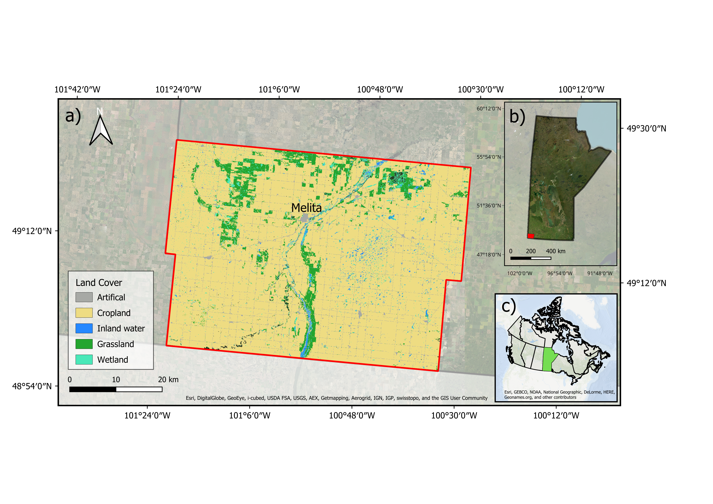

A fixed wing UAV was flown along pre-programmed transects at 120 m altitude. Upon detection of a thermal hotspot, the pilot transitioned to manual loitering and adjusted camera angle and zoom to obtain oblique views of the target. Thermal and visible imagery were recorded simultaneously, allowing species identity to be confirmed by wildlife specialists from the visible footage.

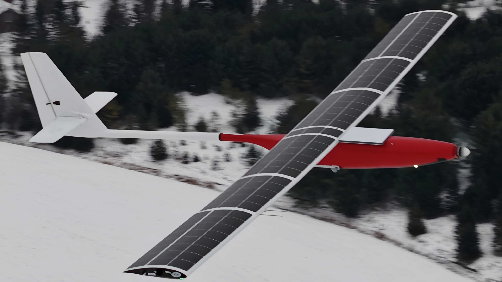

Six survey dates yielded 4,787 images containing 9,243 annotated animals, comprising 2,377 moose and 6,866 deer. Because camera zoom and viewing geometry varied continuously during acquisition, apparent animal size ranged from a few pixels to large close range signatures, producing substantial scale variation within the dataset.

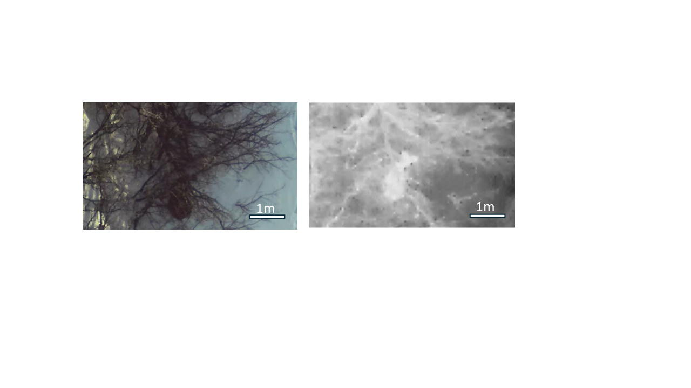

## Methods

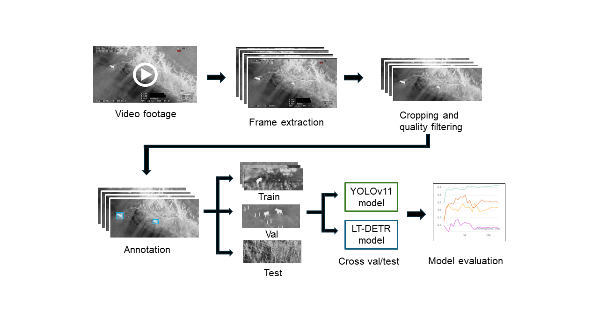

Two detector families were evaluated. YOLOv11 represents the current generation of the CNN detectors most widely applied in wildlife monitoring. LT-DETR is a transformer detector built on DINOv3, a vision foundation model pretrained on 1.7 billion images of natural scenes.

Model performance was assessed using a cross survey evaluation protocol. Rather than partitioning images at random, the data were divided by survey date, such that models were trained on a subset of survey dates and evaluated on dates not seen during training. This approach reflects operational conditions, in which a model trained on existing footage is applied to new surveys. Random partitioning of frames drawn from the same flights produces optimistic performance estimates, because test images closely resemble those used for training. The figure below shows example images from each of the 5 folds used in this study.

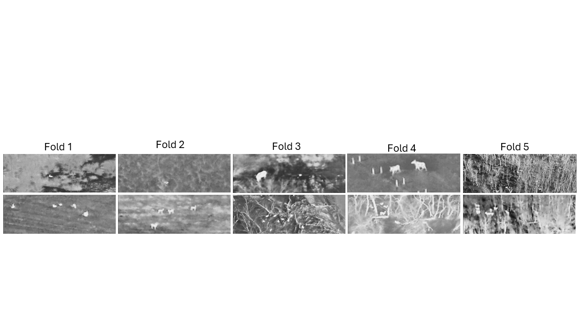

Three further questions were examined: whether detection accuracy varies with the apparent size of the animal in the image; whether foundation model pretraining confers benefit despite the substantial difference between natural scene imagery and thermal aerial imagery; and whether increasing model size improves performance on a dataset of this scale.

## Results

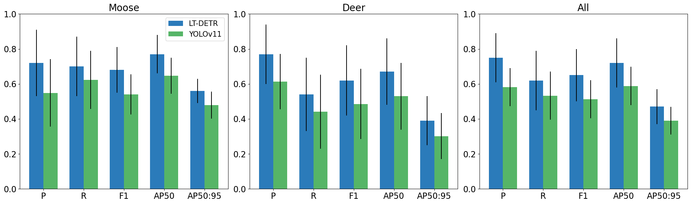

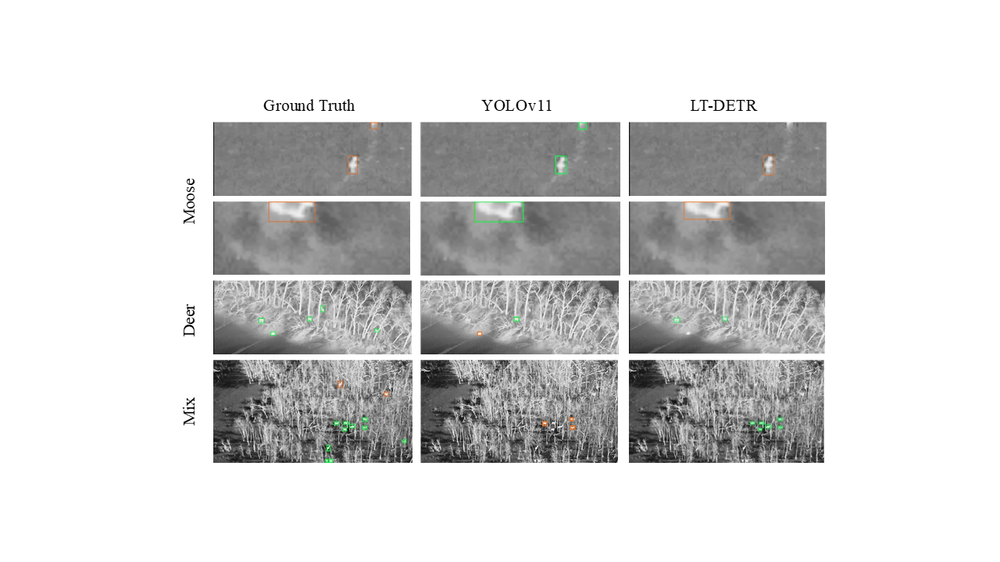

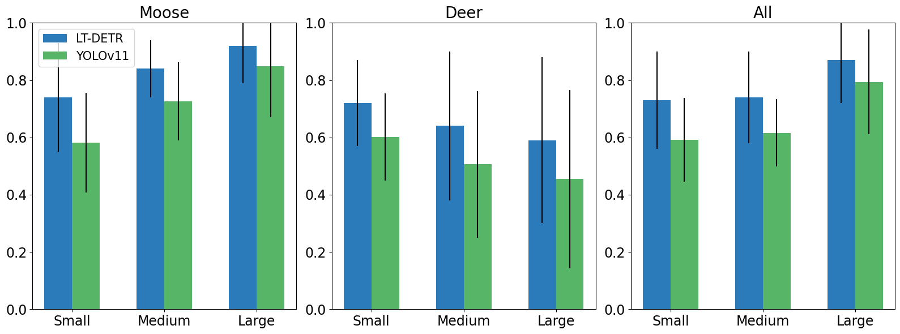

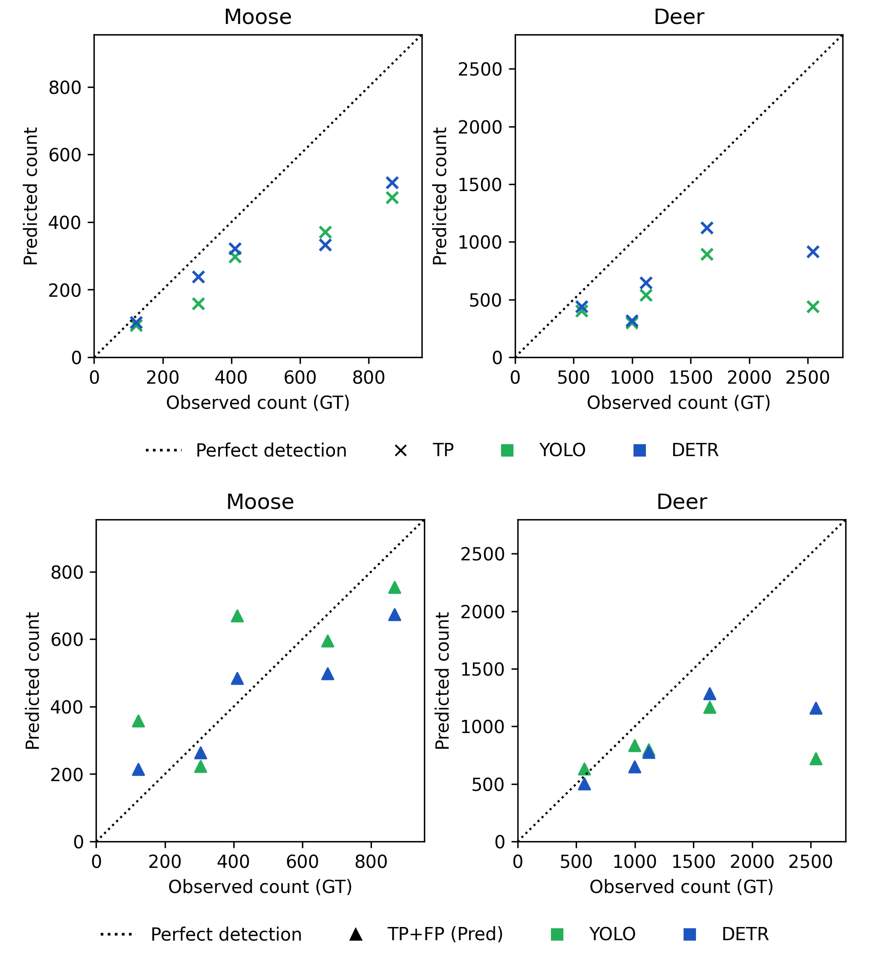

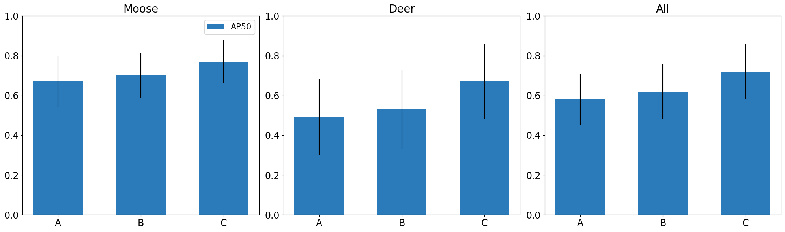

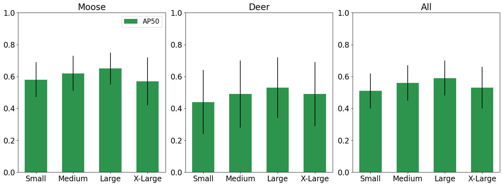

## Key Findings

The transformer detector outperformed the CNN detector across all evaluated metrics. LT-DETR achieved approximately 29% higher precision and 17% higher recall than YOLOv11, with comparable margins on other measures. In operational terms, approximately three quarters of the detections produced by LT-DETR corresponded to real animals, compared with slightly over half for YOLOv11. This advantage is consistent with the characteristics of the imagery: at 120 m altitude, thermal signatures provide limited shape and texture information, conditions under which global contextual reasoning offers an advantage over the local feature extraction on which CNN detectors rely.

Pretraining conferred substantial benefit despite the difference between source and target domains. A model trained from random initialisation achieved considerably lower accuracy than the equivalent model initialised from pretrained weights, even though pretraining was performed on natural scene imagery rather than thermal aerial imagery. Pretraining also accelerated convergence, reducing training time substantially. This benefit was realised only when both the feature extraction backbone and the detection head were pretrained; pretraining the backbone alone produced no reliable improvement.

Model performance did not scale with model size. Accuracy improved from the small to the large YOLOv11 variant, then declined for the extra large variant, which performed comparably to the smallest model tested. Larger models require correspondingly larger training datasets to realise their additional capacity, and appear to overfit when applied to specialised datasets of limited size. Performance rankings reported on generic benchmark datasets therefore do not necessarily transfer to applications of this kind.

Detection performance differed markedly between species. Recall was approximately 70% for moose and 54% for deer. Deer are smaller, frequently occur in groups with overlapping thermal signatures, and were commonly confused with background objects producing similar signatures, including logs, rocks, and fence structures. Moose are larger and typically solitary, and were more often misclassified as deer than missed entirely. Apparent size affected the two species in opposite directions: moose detection improved as animals occupied more of the frame, whereas deer detection declined, most likely because large deer approach the apparent size of moose and are consequently confused with them. Both models undercounted deer substantially, even when all detections were considered regardless of correctness, indicating that population estimates derived from uncorrected model output would be biased, and biased differently between species. Accuracy also varied considerably between survey dates, reflecting differences in canopy cover, background clutter, and imaging conditions.

## Recommendations

1. Automated detection should be deployed as an aid to human review rather than as a replacement for it. At current accuracy, these models are suited to screening footage, generating candidate detections, and reducing the volume of imagery requiring manual inspection. They are not sufficiently accurate to produce population estimates independently, and species level determinations in particular require human confirmation where counts inform harvest regulation, disease surveillance, or herd demographic assessment.

2. Imperfect detection must be quantified and accounted for. Missed animals are not unique to automated methods, as human observers are also subject to imperfect detection. In either case, detection probability should be estimated and incorporated into the detection function before counts are used to derive population estimates.

3. Model selection should be validated on the target dataset. Transformer architectures with foundation model pretraining outperformed the CNN detectors that currently predominate in wildlife monitoring, and pretrained initialisation should be considered standard practice. However, model size should be evaluated empirically rather than selected on the basis of published benchmark performance, as intermediate sized models may outperform larger ones on datasets of limited scale.

4. Evaluation should be conducted across independent surveys. Partitioning frames at random from the same flights yields performance estimates that substantially exceed those achieved when models are applied to new survey conditions.

## Looking Ahead

The principal constraint on further improvement is the quantity and diversity of training data. The present dataset contained only 14 individual moose, and expanding coverage across additional individuals, seasons, and landscapes represents the most substantial opportunity for improvement.

Two further considerations bear on operational deployment. Footage analysed here was collected following pilot detection and manual framing of targets, and frames containing severely degraded or indistinguishable animals were excluded during quality control. Reported accuracy therefore reflects performance on human selected clips rather than continuous survey footage, and evaluation on complete unfiltered flights is required before these methods can directly support population monitoring. In addition, the models operate on individual still frames. Linking detections across consecutive video frames would enable individual animals to be tracked rather than simply detected, which is necessary to convert frame level detections into the abundance estimates required for management.

The dataset and trained models from this study are publicly available.

---

*Goto, H., Coops, N. C., Stenhouse, G., Yi, K. M., Hambrecht, L., & Solmundson, K. Automated detection of moose and deer in thermal imagery using unmanned aerial vehicles and deep learning.* Ecological Informatics*. Dataset: [10.5281/zenodo.20018687](https://doi.org/10.5281/zenodo.20018687)*
